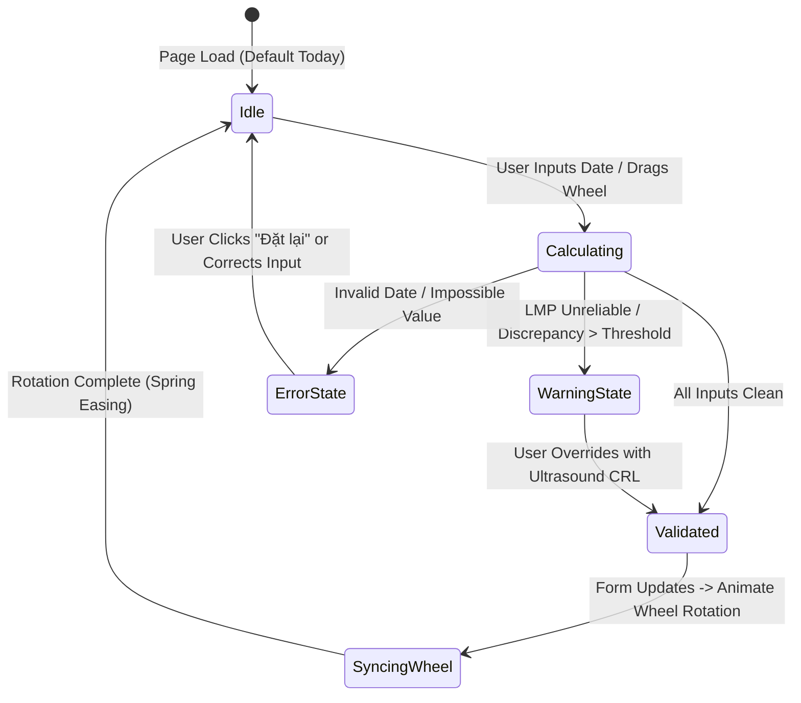

# MASTER ARCHITECTURAL DIRECTIVE: CHRONO-OBSTETRIX
**Role:** Google Stitch Principal Frontend Architect & Senior Medical Systems Engineer.
**Project:** Chrono-Obstetrix: Bio-Luminescent Dual-Ring Pregnancy Wheel & Step-by-Step OSCE Clinical Coach.
**Target Standard:** Academic Department of Obstetrics and Gynecology, University of Medicine and Pharmacy at Ho Chi Minh City (UMP HCMC 2025 Clinical Guidelines).
**Delivery Format:** Single standalone executable file (`index.html`) containing semantic HTML5, pure CSS3 design tokens, and modular vanilla JavaScript. Zero external image dependencies. Zero external framework overhead. 100% offline hospital and clinical examination readiness.

---

## 1. DESIGN THEME & ATMOSPHERE: FRUTIGER AERO & BIO-LUMINESCENT CLINICAL
- **Atmospheric Mood:** Synthesize the optimistic, crystal-clear translucency of Frutiger Aero with high-stakes embryological and obstetrical diagnostic precision.
- **Materiality:** Multi-layered frosted acrylic glass surfaces (`backdrop-filter: blur(24px) saturate(160%)`), water-surface caustics, soft biological phosphorescence, and optical glass rim reflections (`inset 0 1px 1px rgba(255, 255, 255, 0.25)`).
- **Color Philosophy:** Deep oceanic slate depths as substrate (`#0B111A`), illuminated by bioluminescent sea-teal (`#14B8A6`, `#4FD1C5`) and warm embryonic rose (`#F43F5E`, `#FB7185`). No flat opaque panels. No pure unshaded `#000000`.

---

## 2. STRICT ANTI-SLOP & ANTI-AI DESIGN GUARDRAILS (MANDATORY)
You MUST enforce the following constraints to eliminate all generic AI templates and boilerplate aesthetics:
1. **ZERO EM-DASHES (`—` or `–`):** The em-dash and en-dash characters are strictly forbidden in all visible UI copy, titles, labels, badges, and comments. Use regular hyphen `-` or colons/parentheses.
2. **NO GENERIC 3-COLUMN EQUAL CARDS:** Use an asymmetric layout (45% sticky interactive wheel, 55% clinical console with stacked reasoning trays).
3. **NO GENERIC AI FILLER VERBS:** Avoid "Elevate", "Revolutionize", "Seamless", "Next-Gen", "Unleash". Use precise clinical and mathematical terms ("Calculate", "Verify", "Rotate", "Arbitrate", "Enforce").
4. **NO HERO VERSION LABELS:** Do not add fake version badges (`v2.0`, `BETA`, `v0.1`) in the header.
5. **NO GENERIC FONT DEFAULT:** Do NOT default to Inter. Use `Plus Jakarta Sans` for titles and body, and `JetBrains Mono` for tabular clinical dates and calculations.
6. **NO FAKE DIV SCREENSHOTS:** Every dial, input, and readout must be a fully functional, interactive element.

---

## 3. THREE-TIER CSS DESIGN TOKENS ARCHITECTURE
You MUST inject and strictly enforce the following CSS variable architecture inside `:root`. NEVER use arbitrary inline style properties or ad-hoc Tailwind arbitrary values:

```css
:root {
  /* Tier 1: Primitives */
  --teal-50: #E6FFFA; --teal-300: #4FD1C5; --teal-400: #2DD4BF; --teal-500: #14B8A6; --teal-900: #042F2E;
  --rose-50: #FFF1F2; --rose-400: #FB7185; --rose-500: #F43F5E; --rose-900: #4C0519;
  --amber-400: #FBBF24; --emerald-400: #34D399;
  --slate-950: #0B111A; --slate-900: #0F172A; --slate-800: #1E293B; --slate-700: #334155; --slate-400: #94A3B8; --white: #FFFFFF;
  --ease-spring: cubic-bezier(0.19, 1, 0.22, 1);
  --ease-bounce: cubic-bezier(0.34, 1.56, 0.64, 1);

  /* Tier 2: Semantics */
  --bg-canvas: var(--slate-950);
  --bg-card: rgba(15, 23, 42, 0.75);
  --bg-card-hover: rgba(30, 41, 59, 0.85);
  --text-main: var(--white);
  --text-muted: var(--slate-400);
  --accent-biolum: var(--teal-300);
  --accent-embryo: var(--rose-400);
  --border-glass: rgba(226, 232, 240, 0.12);
  --border-focus: var(--teal-400);
  --glow-teal: 0 0 24px rgba(20, 184, 166, 0.30);
  --glow-rose: 0 0 24px rgba(244, 63, 94, 0.30);

  /* Tier 3: Components */
  --wheel-size: clamp(320px, 44vw, 560px);
  --card-radius: 1.25rem;
  --btn-radius: 9999px;
  --font-display: 'Plus Jakarta Sans', system-ui, -apple-system, sans-serif;
  --font-mono: 'JetBrains Mono', 'Fira Code', monospace;
}
```

---

## 4. CORE MEDICAL ALGORITHMIC ENGINE (UMP HCMC STANDARDS)
Implement a robust, bug-free mathematical calculation engine with zero approximations:

### A. Reliability Audit of Last Menstrual Period (LMP)
Verify 4 obligatory criteria:
1. Regular cycles (28 to 30 days for at least 3 consecutive cycles).
2. Exact recall of the first day of menstrual bleeding.
3. No hormonal contraceptives used within the last 3 months.
4. Not currently lactating or breastfeeding causing postpartum amenorrhea.
*Rule:* If any condition fails, flag LMP as UNRELIABLE. The system MUST enforce First Trimester Ultrasound (CRL) as the golden reference.

### B. Naegele Formula Calculation (Calendar Leap-Year Aware)
- Standard: EDD = (Day + 7) / (Month - 3) / (Year + 1).
- If Month is 1, 2, or 3: EDD = (Day + 7) / (Month + 9) / (Year + 0).
- Account for exact month lengths (30 vs 31 days) and February leap years when counting elapsed gestational days.

### C. First Trimester Ultrasound (Crown-Rump Length - CRL)
- Valid Range: CRL = 10 to 84 mm (10 to 13+6 weeks).
- Rapid Clinical Formula: Gestational Age (days) = 42 + CRL (mm).
- Discrepancy Arbitration (ACOG / ISUOG):
  - If under 9 weeks (CRL < 23 mm): If absolute difference > 5 days -> Adopt Ultrasound CRL.
  - If 9 to 13+6 weeks (CRL 24 to 84 mm): If absolute difference > 7 days -> Adopt Ultrasound CRL.
  - Otherwise, maintain LMP as official EDD.

### D. In Vitro Fertilization (IVF / ART) Absolute Reference
- Day 3 Embryo Transfer: Gestational Age (days) = (Exam Date - Transfer Date) + 17 days.
- Day 5 Blastocyst Transfer: Gestational Age (days) = (Exam Date - Transfer Date) + 19 days.
- *Hard Clinical Law:* NEVER adjust IVF gestational age backwards based on ultrasound. Smaller biometric measurements indicate Early FGR or chromosomal anomalies, NOT dating errors.

### E. Clinical Correlates
- Symphysis-Fundal Height (BCTC) estimation: Expected BCTC (cm) = Gestational Age (weeks) - 4.
- Trimester classification: Quý 1 (1 to 13+6w), Quý 2 (14 to 27+6w), Quý 3 (28 to 40+6w).

---

## 5. DUAL-RING VECTOR PREGNANCY WHEEL (INTERACTIVE SVG/CANVAS)
Build a fully interactive, hardware-accelerated concentric dual-ring wheel:
1. **Outer Ring (Fixed Calendar Dial):**
   - 365 radial tick marks representing days, organized into 12 labeled months.
   - Distinct bioluminescent marker indicating Today or Selected Exam Date.
2. **Inner Disc (Rotatable Gestational Dial):**
   - Luminous Red Indicator Needle at Day 0: Kỳ kinh cuối (LMP).
   - Golden Needle at Day 14: Thụ tinh quy ước (+14 ngày).
   - Neon Teal Needle at Day 280 (Week 40): Dự sinh (EDD - 40 tuần).
   - Radial sectors colored with glowing translucent gradients for the 3 trimesters.
   - Milestone Badges plotted around the perimeter:
     - Tuần 11 - 13+6: Đo NT, Combined Test / NIPT.
     - Tuần 20 - 22: Siêu âm hình thái học chi tiết.
     - Tuần 24 - 28: Nghiệm pháp dung nạp 75g Glucose (OGTT).
     - Tuần 28: Tiêm VAT uốn ván mũi 1 / Anti-D.
     - Tuần 35 - 37: Cấy que phết âm đạo - hậu môn GBS.
     - Tuần 37 - 41+6: Thai đủ tháng.
3. **Rotational Physics & Interaction:**
   - Supports seamless drag via mouse pointer and single-finger mobile touch.
   - Calculate drag angles via `atan2(y - centerY, x - centerX)`.
   - Dynamic snap-to-day upon release with subtle spring damping.
   - Two-way synchronization: Spinning the wheel dynamically updates the input form; modifying the form smoothly rotates the wheel via CSS custom property `--wheel-rotation`.

---

## 6. UI COMPONENT HIERARCHY & SEMANTIC HTML
Structure the layout without generic `<div>` soup:
- `<header class="app-header">`: Logo with pulsing bioluminescent nucleus, title `CHRONO-OBSTETRIX`, and clinical badge `ĐHYD TP.HCM // Y4 OSCE SUITE`.
- `<main class="app-workspace">`:
  - `<section class="wheel-stage" aria-label="Interactive Pregnancy Wheel">`: Contains SVG Dual-Ring Wheel, rotation degree display, and quick-action buttons (`[Đồng bộ với Form]`, `[Về hôm nay]`, `[Đặt lại]`).
  - `<section class="clinical-console" aria-label="Clinical Calculation Console">`:
    - `<nav class="mode-tabs" role="tablist">`: Segmented pill switchers for 4 modes: `LMP Mode`, `CRL Ultrasound Mode`, `IVF/ART Mode`, `Reverse EDD Mode`.
    - `<form class="input-form">`: Accessible fields with `<fieldset>`, `<legend>`, and custom glass checkboxes for the 4-point LMP reliability checklist.
    - `<output class="hero-metric-card" aria-live="polite">`: Large glowing monospace readout displaying:
      * **Tuổi thai chính thức:** `XX tuần YY ngày` (`XX+Y tuần`).
      * **Ngày dự sinh chính thức:** `DD/MM/YYYY`.
      * **Giai đoạn thai kỳ và BCTC ước tính (cm)**.
      * **Căn cứ pháp lý:** (`Chuẩn siêu âm CRL quý 1`, `LMP tin cậy`, hoặc `Chuẩn tuyệt đối IVF`).
    - `<article class="osce-coach-card">`: Expandable Step-by-Step Pedagogical Breakdown:
      * Step 1: Thẩm định giá trị pháp lý kỳ kinh cuối.
      * Step 2: Tính nhẩm Naegele và đếm ngón tay trong phòng thi.
      * Step 3: Trọng tài siêu âm CRL quý 1 (công thức 42 + CRL và luật ACOG/ISUOG).
      * Step 4: Thụ tinh ống nghiệm IVF và bẫy thi cấm lùi tuổi thai.
      * Step 5: Lộ trình các cột mốc sàng lọc chu sinh.
    - `<aside class="osce-rubric-card">`: 5-Minute OSCE Station 1 Checklist (10.0-point scoring rubric according to UMP examiners).

---

## 7. COMPONENT STATE MACHINE & INTERACTION MODEL

### A. State Diagram


### B. Touch vs Pointer Disaggregation
- **Touch (Mobile Viewport < 1024px):**
  - Minimum touch target bounding box: 44x44px for all needles, dials, and pills.
  - Disable browser touch-action (`touch-action: none`) on the SVG wheel canvas to prevent screen panning during rotational drag.
  - Provide haptic-like visual ticks when crossing day boundaries.
- **Pointer (Desktop Viewport >= 1024px):**
  - Smooth magnetic cursor snapping near key milestone needles.
  - Fluid tooltip hover reveals describing clinical procedures for every week mark.

### C. Error Recovery & Affordances (Don Norman Principles)
- NEVER present a dead-end error message.
- If LMP is flagged unreliable, render an amber callout with a direct one-click action button: `[Chuyển sang Mode Siêu âm CRL]` which automatically populates and focuses the CRL input.
- If CRL < 10 mm or > 84 mm, render clinical guidance explaining biological measurement validity windows.

---

## 8. CODE DELIVERY CONTRACT (ZERO PLACEHOLDERS)
- Generate the **ENTIRE, COMPLETE, PRODUCTION-READY `index.html`** file.
- Absolutely NO abbreviations, NO `/* TODO */`, NO `// ... rest of code`, and NO incomplete functions.
- All Vietnamese strings must preserve authentic medical terminology and full UTF-8 diacritics.
- Include Google Fonts link for `'Plus Jakarta Sans'` and `'JetBrains Mono'`.
- Verify that drag rotation, milestone snap, Naegele date calculations, and step-by-step reasoning render flawlessly in any modern desktop or mobile browser.
